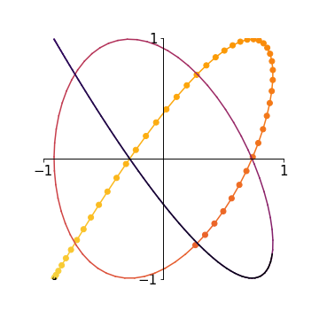
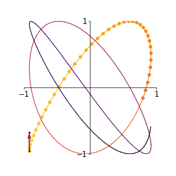
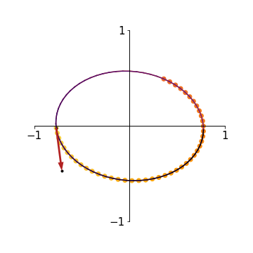

# lissajous_patterns

Python script to simulate the motion of [sand pendulums](<https://www.youtube.com/watch?v=uPbzhxYTioM>). The resulting patterns are called [Lissajous patterns](<https://en.wikipedia.org/wiki/Lissajous_curve>). I developed this script to help design my sand pendulum exhibit at the 2018 Cheltenham Science Festival [MakerShack](<https://www.cheltenhamfestivals.com/science/about/what-can-i-do-for-free/makershack>). 

## Running the script

Run the program from the command line as follows: 

``` 
python lissajous_patterns.py
```

A GUI will be created in which you can tweak the pendulum and simulation parameters. 

The plot axes show the location of the pendulum bob over time. The origin is the pendulum's resting position (hanging straight down). Start a simulation by clicking somewhere on the axes. 

- A single click represents simply releasing the pendulum---pulling it to the mouse click location and letting go. This gives the pendulum zero initial velocity. 

  

- A click and drag represents "throwing" the pendulum---pulling it to the mouse click location and throwing it in the mouse drag direction. This gives the pendulum some initial velocity, as indicated by the arrow on the plot. The distance you drag the mouse before releasing affects the magnitude of the initial velocity. 

  
  
- To simulate the motion of a single pendulum, set L=1 and l=1. You will need to give the pendulum some initial velocity to create loops in the trajectory. 

  